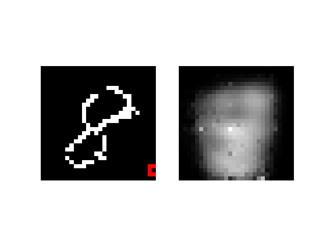
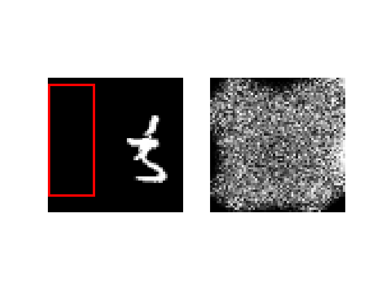
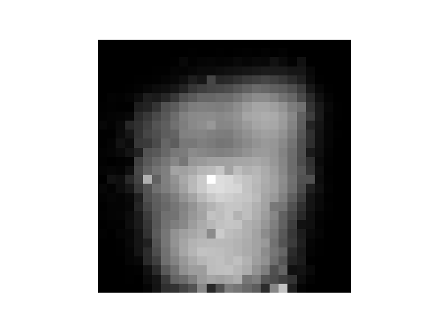

# DRAW 

### Примеры работы автоэнкодера



### Пример генерации изображения:



```bash
git clone https://github.com/nine-k/DRAW
cd DRAW
pip install -r requirements.txt
```

### Запуск обучения модели

Возможные значения параметра  --config:

| Значение     | Описание            |      
|--------------|---------------------|
| MNIST_NO     |  MNIST без внимания |
| MNIST_ATT    | MNIST с внимением   |
| DD_MNIST_ATT | MNIST two digits c вниманием|

Пример запуска main
```bash
python run main.py --config MNIST_NO
```

### Стохастическая генерация изображений

| Параметр        | Описание            |      
|-----------------|---------------------|
| --model (-m)    | путь к модели       |
| --dataset (-d)  |  MNIST или MNIST_DD |
| --prefix (-p)   | имя гиф-изображения |

Пример запуска генерации изображения
```bash
python run generate.py \
  --model DD_MNIST_ATT_19 \
  --prefix test_prefix \
  --dataset MNIST
```

### Генерация гиф-изображений, иллюстрирующих работу

| Параметр        | Описание            |      
|-----------------|---------------------|
| --model (-m)    | путь к модели       |
| --dataset (-d)  |  MNIST или MNIST_DD |
| --prefix (-p)   | имя гиф-изображения |


Пример запуска генерации гифки
```bash
python run visualise.py \
  --model DD_MNIST_ATT_19 \
  --prefix test_prefix \
  --dataset MNIST
```
Пример результата


```bash

```

